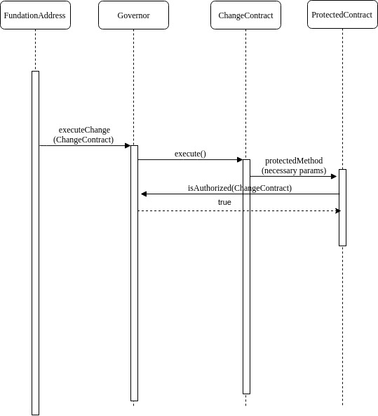

# Areopagus

> Money on Chain Governance Smart Contract System

# Introduction

This project is a suite of smart contracts dedicated to providing a governance system which is generic enough to work without knowing the system to be governed although being originally designed to use in the Money On Chain(MoC) project. This governance tries to accomplish three different things, which are, managing protected calls to the system(in MoC this were used to change the parameters of the model), managing the upgradeability of the smart contracts in the system and stopping the smart contracts in the case of an emergency.

## Overview

The last two of this characteristics are supported by the first so lets explain that one first.

### Protected calls

With the flexibility aforementioned in mind, the changes planed are done through "Change Contracts". This smart contracts are ephimeral and intended to be used only once. They act like a recipe, so the changes planned to be done can be reviewed by the community first. This scheme of Smart Contract is represented in the Figure 1. There you can see how the three smart contract have a reference to each other.


The Figure 2 shows how a fundation address would activate a change in a protected contract.



This use of a Change contract enables to do any change allowed by the protected contract without the need for the Governor to know the changes allowed by the contract or even its ABI, so the Governor can be used to govern any contract.

### Upgradeability

The upgradeability is managed through the protected calls mentioned before with the proxies of Zeppelin OS([pattern used article](https://docs.zeppelinos.org/docs/pattern.html)).

The basic scheme to do the upgradeability is shown in the Figure 3. First an external address calls the governor pointing to a changeContract made for this (possibly you will want to extend from UpgraderTemplate.sol to make this contract) finally reaching to the proxy which then is called with a initialize2 in order to set all the variable needed after the upgrade.


The relationship between the contracts is displayed in the figure 4.


This combination of Zeppelin OS transparent proxy and the need to upgrade as much as possible in the governance system led us to the necessity of having the upgradeDelegator. This contract is not only in charge of being an adapter between the proxyAdmin of ZeppelinOS, which issues upgrades if told so by an _owner_ address, and the governance system where every changeContract is ephemeral. It also makes possible that the admin and the contract who is in charge of consulting the governor if an address is authorized to change something are two different addresses, otherwise it will not work because the transparent proxy pattern allows an address to access only a set of the functions of a contract; either the proxy functions or the implementation's ones, not both. This more quirky case is displayed in the figure 5.


# Data Dictionary

- _MoC_: Money on Chain, referring to the Money on Chain system

# Getting started

## Install dependencies

First you should use the right node version, if you are using nvm just run `nvm use`. Otherwise verify that you are using node 8.12.

Then you should install the dependencies with `npm install`

## Run Tests

- run: `npm test`

## Deploy

(Truffle suit)[https://github.com/trufflesuite/truffle] is recommended to compile and deploy the contracts. There are a set of scripts to easy this process for the different known environments.

Depending on the type of deploy you want to do and where do you want to deploy you should use one of the following scripts:

-`npm run deploy-reset-[ENV]`: Deploys from scratch in the the given environment (*)

-`npm run migrate-[ENV]`: Deploy from previous point in the given environment (*)

 _(*) Note:_ [ENV] should match one of the `truffle.js` configured environments, `dev` for local.

Any of them will display at the end all the address relevant to the deploy. You should write them down to later use it in the deploy of your own system.

## Run an EVM compatible blockchain node locally

You can use any of the following two. For tests purposes is recommended to do it with ganache.

### Run Ganache-cli

To do most of the

- Globally:

```sh
npm run ganache-cli
```

### Run Rsk Local Node

- With Docker:
  See this repository: https://github.com/rsksmart/artifacts/tree/master/Dockerfiles/RSK-Node
